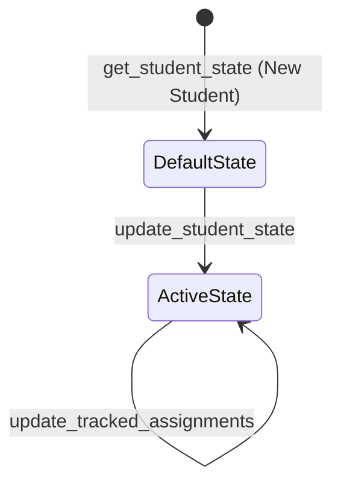

# Phase 1 Data Model: GCP Cloud Firestore Student State Persistence Engine

**Branch**: `006-phase-1-1-firestore-state-engine`  
**Date**: 2026-08-24  
**Spec**: [spec.md](./spec.md)

---

## Firestore Collection Schema

### Document Path: `students/{student_id}`

The root document path for each student state object is `students/{student_id}` (e.g., `students/student_12345`).

---

## Data Models (`src/storage/models.py`)

### 1. `GradeSnapshot`
Represents a single historical record of a student's course grade at a specific timestamp.

| Field | Type | Required | Description |
|---|---|---|---|
| `date` | `str` | Yes | ISO-8601 formatted date string (`YYYY-MM-DD`). |
| `percentage` | `float` | Yes | Numerical course grade percentage (e.g., `88.5`). |
| `letter_grade` | `str` | Yes | Official letter grade designation (e.g., `"B+"`). |

---

### 2. `CourseState`
Represents the current academic state and historical trajectory for a single enrolled course.

| Field | Type | Required | Default | Description |
|---|---|---|---|---|
| `course_id` | `str` | Yes | - | Unique course identifier (e.g., `"MATH-101"`). |
| `name` | `str` | Yes | - | Full course display name. |
| `current_percentage` | `float` | Yes | `0.0` | Latest recorded course percentage. |
| `letter_grade` | `str` | Yes | `"N/A"` | Latest recorded letter grade. |
| `history` | `List[GradeSnapshot]` | No | `[]` | Chronological list of daily grade snapshots. |

---

### 3. `TrackedAssignment`
Represents an assignment being monitored across LMS/SIS platforms for grace period calculation and missing work detection.

| Field | Type | Required | Default | Description |
|---|---|---|---|---|
| `assignment_id` | `str` | Yes | - | Unique identifier for assignment. |
| `title` | `str` | Yes | - | Assignment title. |
| `course_id` | `str` | Yes | - | Parent course identifier. |
| `due_at` | `Optional[str]` | No | `None` | ISO-8601 due date timestamp. |
| `submission_type` | `str` | No | `"unknown"` | Type of submission (e.g. `"online"`, `"paper"`). |
| `status` | `str` | Yes | `"missing"` | Current assignment status (`"missing"`, `"submitted"`, `"graded"`). |
| `first_detected_missing` | `str` | Yes | Current ISO Timestamp | Timestamp when assignment was first flagged missing. |
| `alert_dispatched` | `bool` | No | `False` | Flag indicating if alert notification has been sent. |

---

### 4. `AttendanceEvent`
Represents an attendance anomaly event flagged by PowerSchool ingestion.

| Field | Type | Required | Default | Description |
|---|---|---|---|---|
| `event_id` | `str` | Yes | - | Unique identifier for attendance record. |
| `date` | `str` | Yes | - | Date of attendance event (`YYYY-MM-DD`). |
| `period` | `str` | Yes | - | Class period designation (e.g., `"Period 2"`). |
| `course` | `str` | Yes | - | Name of course during attendance event. |
| `code` | `str` | Yes | - | Attendance code (e.g., `"UNX"` for Unexcused Absence, `"T"` for Tardy). |
| `notified` | `bool` | No | `False` | Whether notification router has processed this event. |

---

### 5. `SessionCookies`
Encrypted container for PowerSchool browser scraper session state.

| Field | Type | Required | Default | Description |
|---|---|---|---|---|
| `psaid` | `str` | Yes | - | Encrypted SAML session token/cookie payload. |
| `updated_at` | `str` | Yes | Current ISO Timestamp | ISO-8601 timestamp when session cookie was saved. |

---

### 6. `StudentState` (Master Document)
The top-level model representing the complete Firestore document stored at `students/{student_id}`.

| Field | Type | Required | Default | Description |
|---|---|---|---|---|
| `student_id` | `str` | Yes | - | Primary Key / Document ID. |
| `last_synced_at` | `str` | Yes | Current ISO Timestamp | Timestamp of last batch sync execution. |
| `session_cookies` | `Optional[SessionCookies]` | No | `None` | Encrypted session cookies for scraper reuse. |
| `courses` | `Dict[str, CourseState]` | No | `{}` | Map of `course_id` -> `CourseState`. |
| `tracked_assignments` | `Dict[str, TrackedAssignment]` | No | `{}` | Map of `assignment_id` -> `TrackedAssignment`. |
| `attendance_events` | `List[AttendanceEvent]` | No | `[]` | List of attendance anomaly records. |

---

## State Transition Rules

---

## Validation Logic
- All datetimes MUST be formatted as ISO-8601 strings.
- Percentages MUST be numeric (`float`) between `0.0` and `100.0` (or `>100.0` for extra credit).
- Malformed state objects raise `pydantic.ValidationError` before any call to `set()` or `update()`.
