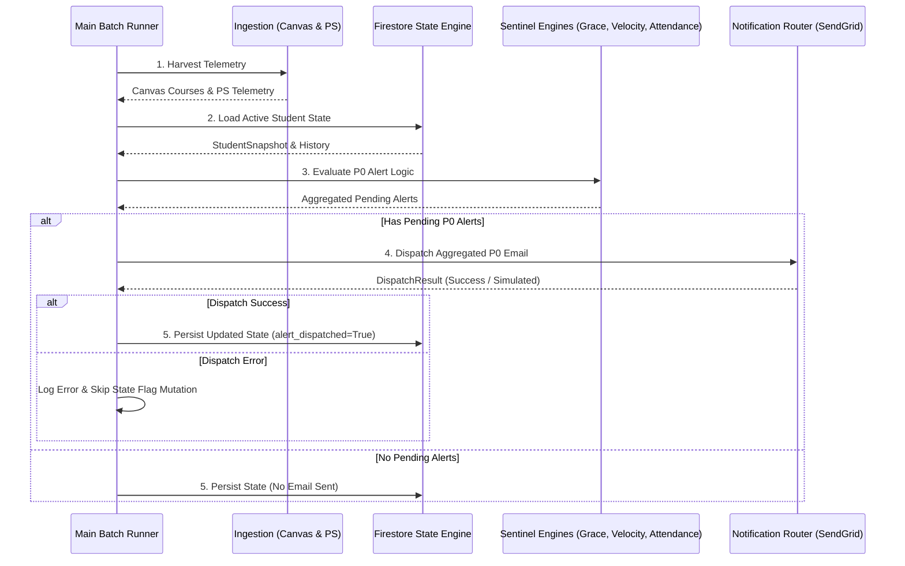

# Research & Architecture Notes: Phase 1.5 SendGrid Responsive Email Router

## 1. SendGrid Web API v3 Direct Integration Strategy

### Decision: Direct HTTP REST Call via `urllib.request` / `requests`

Rather than adding heavy vendor SDK dependencies, `SendGridClient` will perform direct HTTP POST calls to `https://api.sendgrid.com/v3/mail/send`.

- **Endpoint**: `POST https://api.sendgrid.com/v3/mail/send`
- **Headers**:
  - `Authorization: Bearer <SENDGRID_API_KEY>`
  - `Content-Type: application/json`
- **Payload Schema**:
  ```json
  {
    "personalizations": [
      {
        "to": [{"email": "parent@example.com"}]
      }
    ],
    "from": {"email": "alerts@bellmon.app", "name": "Bellmon Academic Sentinel"},
    "subject": "[P0 ALERT] Urgent Academic Sentinel Notification",
    "content": [
      {"type": "text/plain", "value": "Plaintext fallback content..."},
      {"type": "text/html", "value": "<html>Responsive HTML content...</html>"}
    ]
  }
  ```
- **Response Codes**:
  - `202 Accepted`: Success (Returns `message-id` header or generated UUID).
  - `4xx / 5xx`: Failure (Throws exception, triggering retry logic on next batch run).

---

## 2. Responsive HTML Email Design System

### Design Tokens & Layout Rules
- **Container**: Max width 600px, centered (`margin: 0 auto`), light background `#f8fafc`, dark card `#0f172a` or crisp white `#ffffff` with subtle border.
- **Header**: High contrast brand banner (Navy/Indigo `#1e293b`), bold title "Bellmon Academic Sentinel".
- **Sections**:
  1. **Urgent P0 Missing Work Alerts** (Red accent `#ef4444` / `#dc2626`)
  2. **Grade Velocity Drop Alerts** (Orange accent `#f97316`)
  3. **Attendance Anomaly Alerts** (Purple accent `#a855f7`)
- **Typography**: System sans-serif (`-apple-system, BlinkMacSystemFont, "Segoe UI", Roboto, sans-serif`).
- **Footer**: Single daily batch summary notice & direct portal links.

---

## 3. End-to-End Orchestration Architecture (`main.py`)

### Execution Pipeline Sequence


