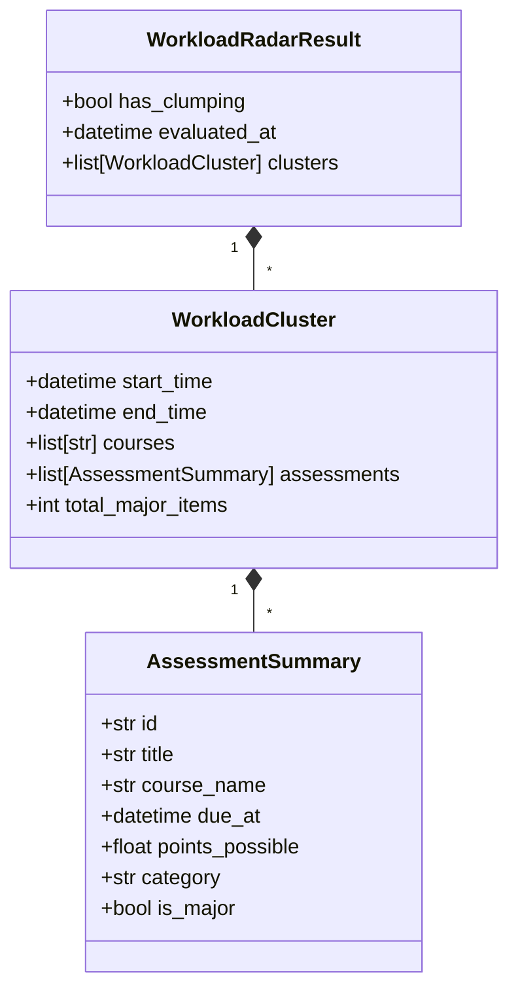

# Data Model: 011 Phase 2.1 Workload Clumping Radar

## Field Specifications

### `AssessmentSummary`
- `id`: Unique identifier (e.g. Canvas assignment ID or synthetic hash).
- `title`: Name of the assignment or exam.
- `course_name`: Display name of the course.
- `due_at`: UTC ISO timestamp of due date.
- `points_possible`: Max score obtainable.
- `category`: Group/category name.
- `is_major`: Boolean flag indicating if classified as major assessment.

### `WorkloadCluster`
- `start_time`: Due timestamp of the first assessment in the cluster.
- `end_time`: Due timestamp of the last assessment in the cluster.
- `courses`: Sorted list of distinct course names involved in this cluster.
- `assessments`: List of `AssessmentSummary` objects in the cluster.
- `total_major_items`: Count of assessments in the cluster ($\ge 2$).

### `WorkloadRadarResult`
- `has_clumping`: `True` if `len(clusters) > 0`, otherwise `False`.
- `evaluated_at`: Timestamp when the radar evaluation was executed.
- `clusters`: List of `WorkloadCluster` instances.
