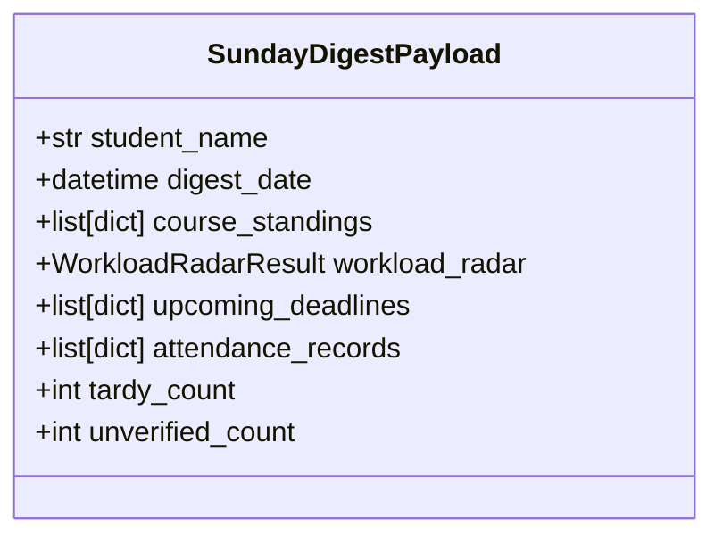

# Data Model: 012 Phase 2.2 Sunday Planning Digest

## Schema Details

### `SundayDigestPayload`
- `student_name`: Name of student.
- `digest_date`: Timestamp when digest is rendered.
- `course_standings`: List of dicts containing `course_name`, `grade_letter`, `grade_percent`, `teacher_name`.
- `workload_radar`: `WorkloadRadarResult` instance from Spec 011.
- `upcoming_deadlines`: List of dicts containing `title`, `course_name`, `due_at`, `points_possible`.
- `attendance_records`: List of attendance anomaly/record dicts.
- `tardy_count`: Number of Tardy records in past 7 days.
- `unverified_count`: Number of Unverified records in past 7 days.
