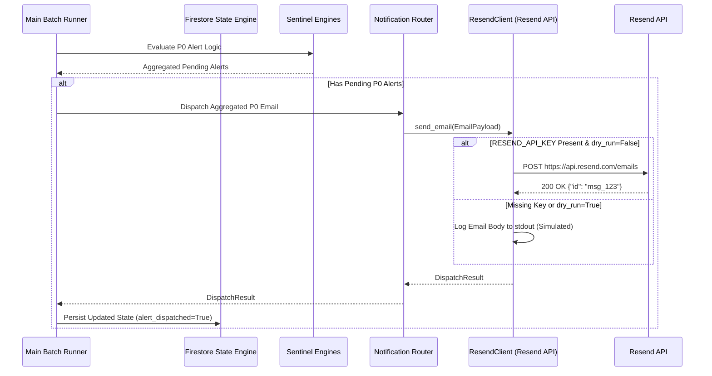

# Research & Architecture Notes: Resend Email Notification Provider Migration

## 1. Resend REST API v1 Direct Integration Strategy

### Decision: Direct HTTP REST Call via `urllib.request` / `requests`

`ResendClient` performs direct HTTP POST calls to `https://api.resend.com/emails` without requiring external third-party SDK dependencies.

- **Endpoint**: `POST https://api.resend.com/emails`
- **Headers**:
  - `Authorization: Bearer <RESEND_API_KEY>`
  - `Content-Type: application/json`
- **Payload Schema**:
  ```json
  {
    "from": "Bellmon Academic Sentinel <alerts@bellmon.dev>",
    "to": ["parent@example.com"],
    "subject": "[P0 ALERT] Urgent Academic Sentinel Notification",
    "html": "<html>Responsive HTML content...</html>",
    "text": "Plaintext fallback content..."
  }
  ```
- **Response Codes**:
  - `200 OK` / `201 Created`: Returns `{"id": "49bf7420-e096-428a-9d67-0504c27ab08d"}`.
  - `400 / 401 / 422 / 500`: Returns JSON error payload `{"statusCode": 422, "message": "...", "name": "..."}`.

---

## 2. Comparison: SendGrid vs. Resend API

| Metric | Legacy (SendGrid) | New (Resend) |
|--------|-------------------|--------------|
| **Endpoint** | `POST https://api.sendgrid.com/v3/mail/send` | `POST https://api.resend.com/emails` |
| **API Key Env Var** | `SENDGRID_API_KEY` | `RESEND_API_KEY` |
| **Payload Structure** | Nested (`personalizations`, `content` array) | Flat (`from`, `to`, `subject`, `html`, `text`) |
| **Success Status Code**| `202 Accepted` | `200 OK` / `201 Created` |
| **Message ID Source** | Response header `X-Message-Id` | JSON body `id` key |

---

## 3. System Architecture Sequence Diagram


